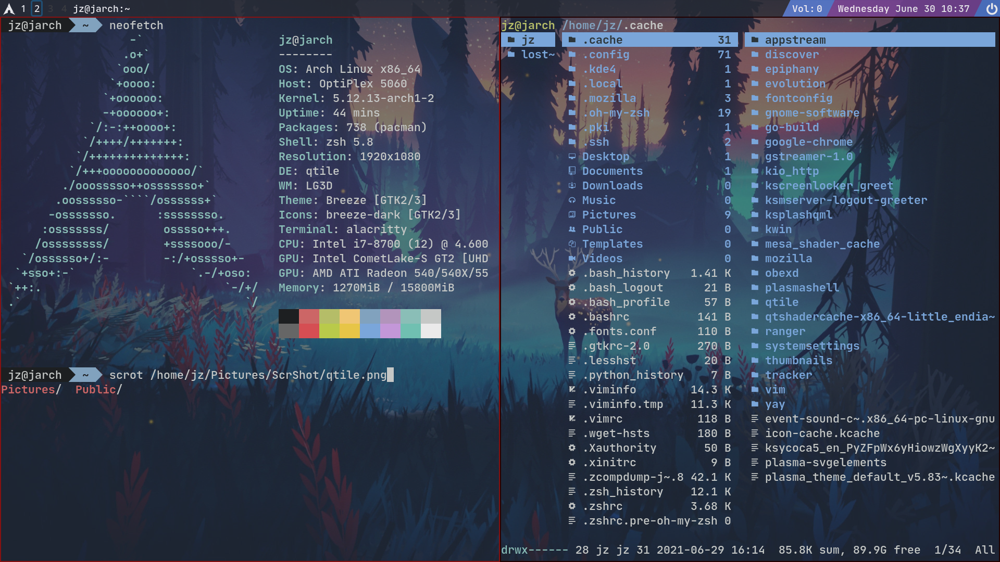

# My Qtile Configurations
----------
## Requirements
First install:
```
nitrogen # setup background image
xcompmgr # X server composite manager
```

To enable the icons that I used in the configurations, [Nerd Font](https://www.nerdfonts.com/) is needed. Installation of [Nerd Font](https://www.nerdfonts.com/) can be found in the website.

*Note*: if your are currently in China, the speed for accessing the nerd font website maybe slow.

## Opacity
To enable the transparency for qtile and your terminal simulator (I use ```alacritty```), you need to install a composite manager (assuming you are using Xorg), such as ```xcompmgr```, ```picom``` or ```compton``` and then add it to your ```autostart.sh``` to make sure it runs once qtile is started. In my case I use ```xcompmgr```.

## Usage
Copy ```config.py``` and ```autostart.sh``` to your ```~/.config/qtile/``` folder. Then restart qtile.

## Reference
I refer some widget configurations from [Derek Taylor](https://gitlab.com/dwt1/dotfiles/-/blob/master/.config/qtile/config.py).

## Fianl effect


