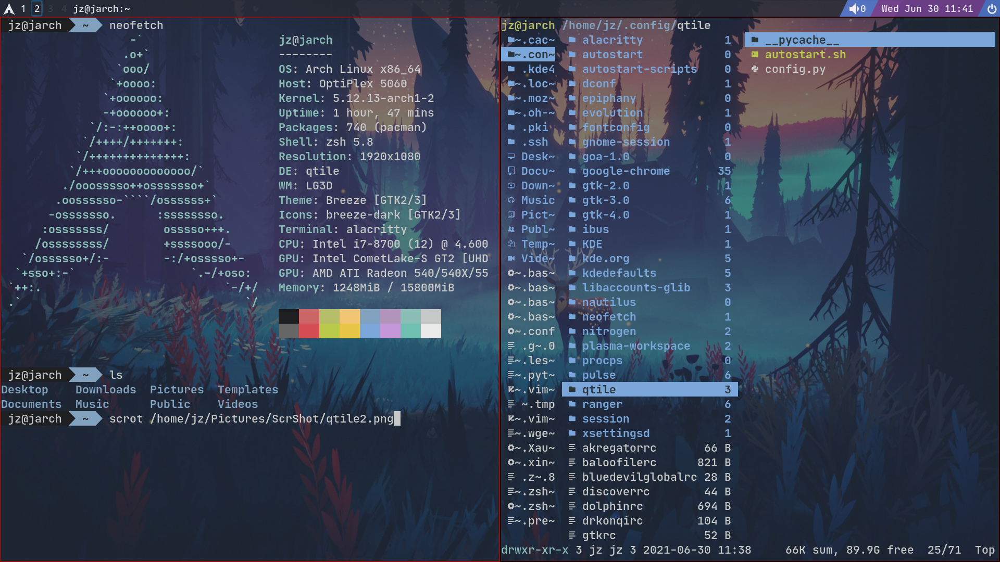

# My Qtile Configurations

Details about Qtile refer to [Qtile main page](http://www.qtile.org/) and [Arch Wiki](https://wiki.archlinux.org/title/Qtile).

## Requirements
First install:
```
nitrogen # setup background image
xcompmgr # X server composite manager
```

To enable the icons that I used in the configurations, [Nerd Font](https://www.nerdfonts.com/) is needed and set one of the nerd fonts as the default font in the configuration. Installation of [Nerd Font](https://www.nerdfonts.com/) can be found in the website. My font setting is "JetBrainsMono Nerd Font Mono Medium"

## Opacity
To enable the transparency for qtile and your terminal simulator (I use ```alacritty```), you need to install a composite manager (assuming you are using Xorg), such as ```xcompmgr```, ```picom``` or ```compton``` and then add it to your ```autostart.sh``` to make sure it runs once qtile is started. In my case I use ```xcompmgr```.

## Usage
Copy ```config.py``` and ```autostart.sh``` to your ```~/.config/qtile/``` folder. Then restart qtile.

## Reference
I refer some widget configurations from [Derek Taylor](https://gitlab.com/dwt1/dotfiles/-/blob/master/.config/qtile/config.py).

*css code test*
<i class="nf-linux-archlinux"></i>

## Fianl effect


